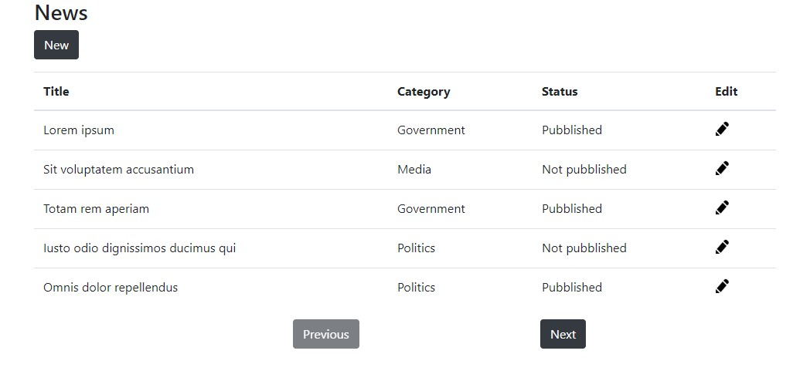
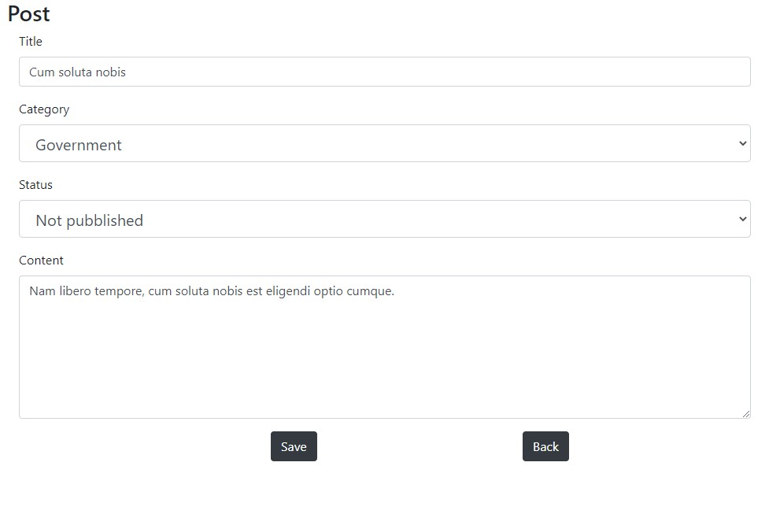

# BackofficeMinisample
Mini sample app with Angular.

## Tools
Tools used:
* NodeJS v10.16.0
* Angular cli v8.0.2
* JsonServer v0.15.0
* Bootstrap v4
* Angular-notifier 4.1.1

```
npm install -g @angular/cli
npm install -g json-server
```

## Setup
/backoffice:
```
npm i
npm start
```

Npm start will run both json server and angular dev server usig 
> json-server --watch ../server/db.json  | ng serve"

#### Otherwise
Frontend /backoffice:
```
npm i
ng serve
```

Backend /server:
```
json-server --watch db.json
```

## Pages
Database items are press articles.

Gui requirements:
* page one, 3 columns table listing db items: title, category and status (bubblished, not pubblished)
* page two, item addition or editing: title, category, content and status.

Categories are a predefined list taken from the backend.
Status can be "pubblished" or "not pubblished".
Backend is simulated whit json-server.



